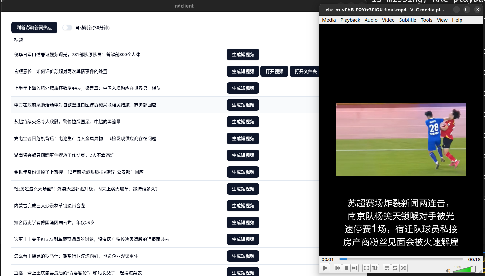

# Reporter Demo

Generate news short video of PengPai News




## Tool chains

You need:

- Rust 1.88
- Bun
- Tauri

## Dev

```sh
bun i
bun tauri dev
```

Set you `config.toml` file at `/src-tauri/config.toml`,

```sh
OPENAI_KEY="DeepSeek API Key"
TTS_URL="https://dashscope.aliyuncs.com/api/v1/services/aigc/multimodal-generation/generation"
ALI_DASHSCOPE_API_KEY="Ali API Key"
```

## Build

```sh
bun i
bun tauri build
```